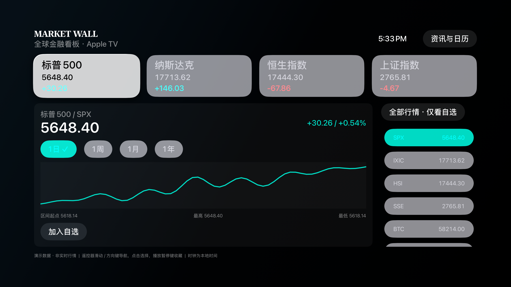

# Android 平板金融看板

原生 Android 版本，面向横屏和竖屏 Android 平板，参考 Fire TV 版本的行情和遥控器体验，但使用平板专用布局。目标是 3K 以内的常见平板分辨率，不把 1920x1080 画布强行缩放到屏幕中央。



## 布局

- 横屏：顶部行情卡，左侧主图，右侧行情列表。
- 竖屏：两列行情卡，上方主图，下方行情列表。
- 触控和方向键都可操作；点击行情卡或列表切换标的。
- 适配 fullSensor，旋转后按新宽高重新计算绘制区域。

## 首次启动与网络状态

应用启动立即使用内置演示数据绘制首屏，并把选中的标的、周期和缓存时间写入 SharedPreferences。网络状态通过 ConnectivityManager 监听：

- 绿色呼吸灯：设备在线。
- 黄色呼吸灯：等待网络状态确定。
- 红色状态：已断线，继续使用缓存。

网络状态只表示设备连接状态，行情仍标记为演示数据。后续接入行情服务时可在 NetworkCallback 的在线分支触发后台更新，失败时保留缓存，不阻塞首屏。

## 构建与安装

```sh
cd tv/androidtablet
export JAVA_HOME=/usr/local/opt/openjdk@17
export ANDROID_HOME=/Users/jacb/Library/Android/sdk
./gradlew --offline :app:assembleDebug
adb install -r app/build/outputs/apk/debug/app-debug.apk
```

最低 Android API 23，目标 API 34。当前 Debug APK 不需要网络权限，仅读取网络连接状态；所有行情都是确定性演示数据。

## 许可

MIT，见 LICENSE。
