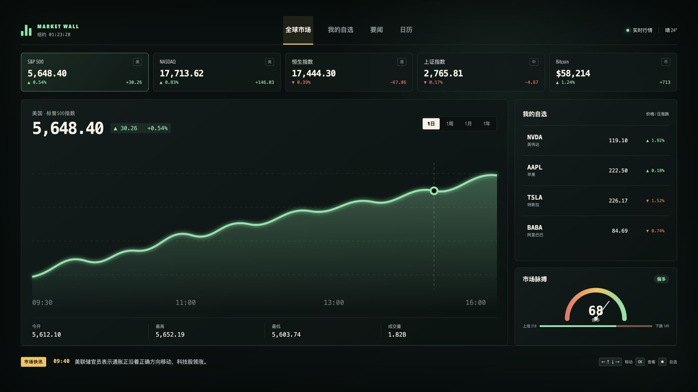

# Market Wall Roku TV Prototype



这是 Roku TV 金融 Dashboard 的浏览器交互原型，使用 1920x1080 逻辑画布，在 3840x2160 浏览器视口中以 2 倍等比显示。字体、图表、边距和焦点框一起缩放；非 16:9 窗口保留黑边，不裁切画面。

内容区为 1534x866，逻辑画布左右留白 193px、上下留白 107px。4K 浏览器视口中分别为 386px 和 214px。此原型尚非 Roku 安装包，原生 SceneGraph 的渲染效果仍需在电视上验证。

## 预览

```bash
cd /Users/jacb/Sites/Families/roku-finance-prototype
python3 -m http.server 4173 --bind 127.0.0.1
```

浏览器打开 `http://127.0.0.1:4173`。使用方向键模拟 Roku 遥控器，按 Enter/空格选择，Esc/Backspace 返回。按 `*` 将焦点所在行情加入或移出自选；未聚焦行情时作用于主图标的。收藏保存在当前浏览器、当前来源的 localStorage 中；浏览器禁止存储时仅在本次会话生效。

## 原型范围

- 全球指数行情条
- 9 个指数、数字资产和股票标的，点击后主图与区间统计同步更新
- 1日、1周、1月、1年周期，包含各自的模拟曲线和时间轴
- 自选列表、收藏持久化、空列表提示
- 市场情绪和涨跌家数
- 要闻和经济日历演示面板
- 底部演示数据提示
- 遥控器焦点导航
- 4K UHD 输出 / 1920x1080 逻辑画布适配

所有价格、曲线、资讯、事件日期和情绪指标均为静态示例或确定性生成的演示数据，不连接行情服务。只有纽约时钟使用当前时间。主图涨跌根据所选周期计算，顶部行情条和热门关注显示日涨跌。长周期没有成交量数据，显示破折号。

下一阶段为 Roku SceneGraph/BrightScript 移植和行情服务接入。本轮仅完善浏览器原型，不包含电视端部署。
